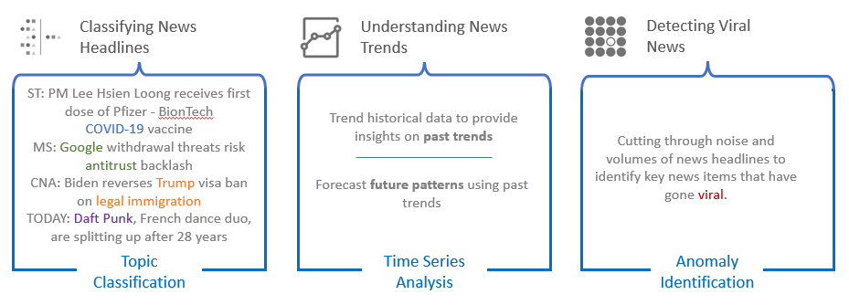
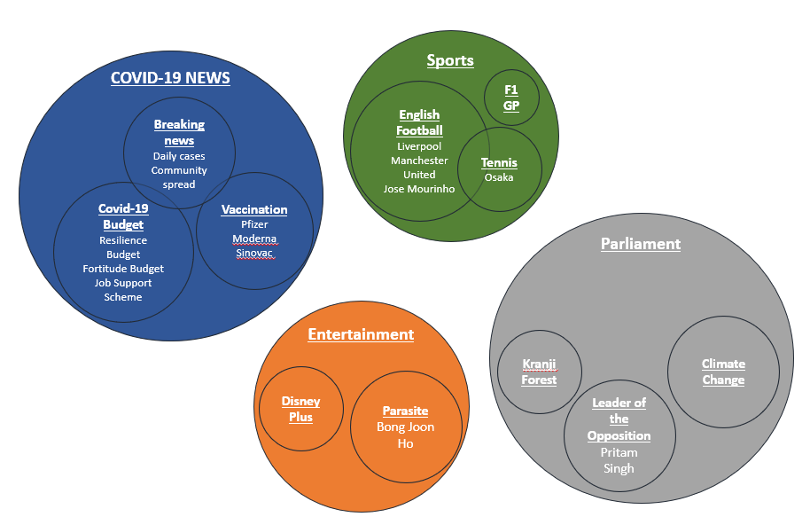
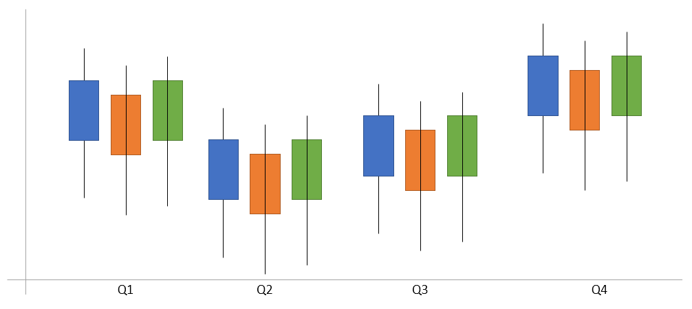
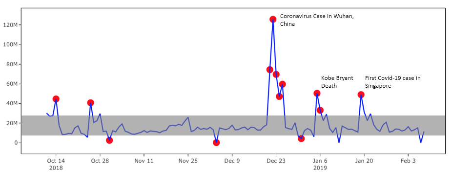

# 1.	Motivations and Objective 
As we become more and more inundated with news from various digital sources today, understanding what the key stories are across the digital spectrum is becoming more and more challenging. 
As such, we are interested in understanding how to best present a visual snapshot of the key stories that are covered in local media and identifying how readers engaged with the news. 

# 2.	Data 
To do this, we will be analysing English news articles published by 9 local news sites for the year of 2020. To identify how readers engaged with each article, we will be using Facebook engagement data (Likes, Shares and Comments) retrieved from CrowdTangle and Prrt. This amounts to 94,841 news articles and its corresponding Facebook engagement data. 

# 3.	Visualisation Features
We plan to feature three visualisation modules: 
-	Topic Classification in order to understand key news topics
-	Time series analysis in order to identify current trends and forecast future ones
-	Anomaly detection in order to detect key news items

## 3.1 Topic Classification 

Topic classification could be the most challenging as it would require text analytics. This is due both to our unfamiliarity with text analytics as well as the localised nature of our news headlines – even if it is in the English language. 

## 3.2 Time Series Analysis 

As we will be looking at an entire year’s worth of data, we should be able to statistically quantify past trends. Using this, we should also be able to forecast future trends, such as predicting the most popular days for news engagement. 

## 3.3 Anomaly Detection 

As it is important to quickly sift through all the noise to identify news trends, we propose building an anomaly detection visualisation that could present articles that have gone viral. This can be done by identifying if there are engagement rates that have fallen outside the norm. 

# 4.	Challenges 

At this current stage, we foresee two main challenges for this project. They are: 
 
##  4.1	Classifying unstructured data 
Much of the project relies on being able classify article headlines for further statistical analysis. As identified above, this is our biggest challenge. Dealing with unstructured data will be difficult especially since the team is unfamiliar with text analytics. 

This will be made tougher as the localised nature of news headlines from local media will mean that we will have less libraries and resources to call upon online. 

## 4.2	Data cleaning for unstructured data
The unstructured nature of the data will also present a second challenge for data cleaning. As much of the data is taken from public scrappers, and Facebook metadata, we have to ensure that there are no duplicates in values as well as odd text in the dataset. 

# 5.	Annex – proposed sites for analysis  
-	Asia One 
-	Channel News Asia 
-	Mothership
-	Must Share News
-	Rice Media
-	Straits Times 
-	The Online Citizen 
-	Today Online 
-	Yahoo SG 

