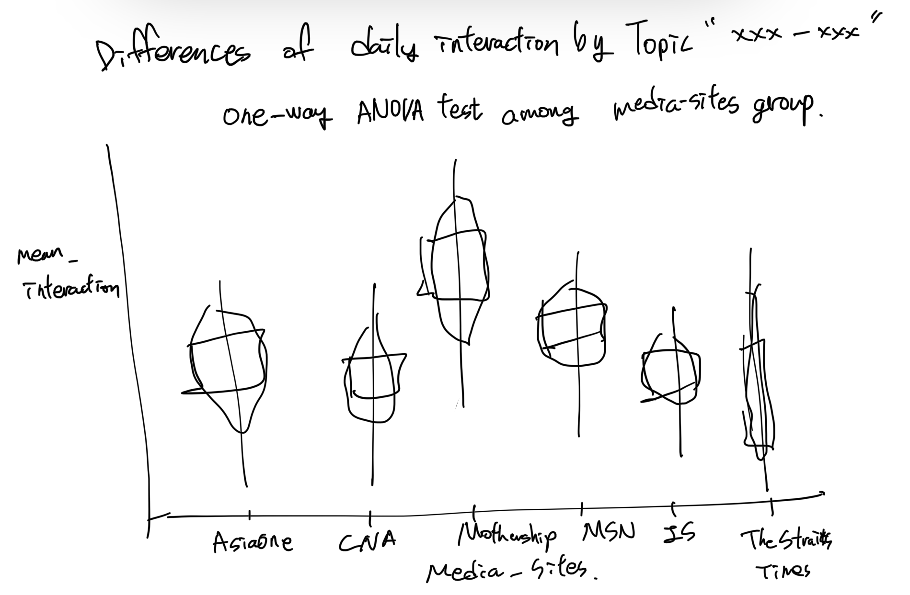

```{r setup, include=FALSE}
knitr::opts_chunk$set(echo = FALSE)
```

# 1. Overview

# 1.1. Purpose of Visualisation

Public gather information from news media and share it via social platform if the information is useful. Therefore, analysing news articles is helpful in understanding public's interests. However, making sense of the news is extremely difficult because (1) everyday huge volume of articles are publishing from multiple media sites, (2) extracting topics and information from each article is not easy, (3) the importance of what people think and what the media think can be different. This project aims to analyse local news headlines published in 2020 and provide readers with useful snapshots of news trend. The scope of this project is to visualise the trends of published articles over time by topics and by media sites. In addition, detecting unusual patterns in news articles will be shown, using time series anomaly detection techniques.


Analysing engagement metrics (the number of Likes, Shares, and Comments in social media) from each article would be helpful to understand public's interests. Newswhip also used the engagement figures to predict the likelihood articles go viral. By visualising daily patterns of engagement figures by media and by topic, we recognise anomalous pattern and public interests more easily.

## 1.2. Sketch of Proposed Visualisation Design

### 1.2.1. One-way ANOVA test for the average daily interaction by topic and by media sites



### 1.2.2. Time series anomaly detection for the average daily interaction by topic and by media sites


# 2. Pre-process Data Set

## 2.1. Prepare data set 

The raw data set was extrated from Prrt which is providing Facebook engagement metrics. The data set contains news headlines, media sites, and date from 1 January 2020 to 31 December 2020. These news articles were published by local media sites, a mix of mainstream (Straits Times, Channel News Asia, AsiaOne) and non-mainstream (Mothership, MustShareNews, The Independent) sites. From this raw data (224k articles), my team decided to filter out articles whose engagement was lower than 10 interactions. Doing this reduces the number of articles in the dataset by 131,235 (or close to 58%) and removes articles that were: (1) removed quickly after A/B testing, (2) removed quickly after editorial corrections, and (3) republished from international news wire agencies and therefore had low to no engagement Finally, 93,166 articles will be used for further analysis. Furthermore, we will use the result of topic modeling for observing trend and detecting anomalous patterns.

## 2.2. Install and Load R packages

The libraries below were used in this analysis. 
- tydyverse: data manipulation and exploration
- plotly: interactive web graphics
- tibbletime/tibble, timetk: data manipulation for time series
- ggstatsplot: interactive web charts
- anomalize: anomaly detection

```{r echo=TRUE, message=FALSE, warning=FALSE}
packages = c('tidyverse', 'readxl', 'dplyr', 'skimr', 'tibble', 
             'ggstatsplot','ggpubr','corrplot','seriation', 'dendextend',
             'tibbletime', 'anomalize', 'timetk','multcomp','devtools', 'car', 
             'DT', 'reshape2', 'plotly', 'ggforce','lubridate','tidyquant','ggplot2')

for(p in packages){
  if(!require(p, character.only = T)){
  install.packages(p)
  }
  library(p, character.only = T)
}
```

## 2.3. Import data file

Import data set which contains topic label (93,116 articles).

```{r echo=FALSE, message=FALSE, warning=FALSE}
article_raw <- read_csv("data/zeroten_final.csv")
article_raw <- article_raw %>%  rename( 'Date' = 'Published')
```

Skim the imported data set. As seen below, it contains 93116 articles, posted by 6 media sites (Source), 20 unique topics (Topic) from "2020-01-01" to "2020-12-31". We will use "Total" field for analysing engagement metrics. 

```{r echo=FALSE, message=FALSE, warning=FALSE}
skimr::skim(article_raw)
```

## 2.4. Handling date field

```{r echo=TRUE, message=FALSE, warning=FALSE}

article_raw$Date <- as.Date(article_raw$Date)
article_raw$month <- as.numeric(format(as.Date(article_raw$Date), "%m"))
article_raw$month <- as.factor(article_raw$month)

```


## 2.5. Aggregate data set by Date, Source, and Topic

Engagement figures should be aggregated by Date, Source, and Topic for time sereis analysis.

```{r echo=TRUE, message=FALSE, warning=FALSE}
article_daily <- article_raw %>% 
  group_by(Source, Date, Topic) %>% 
  summarise(mean_interaction =  mean(Total, na.rm= TRUE))
article_daily$mean_interaction <- round(article_daily$mean_interaction, 0)
datatable(article_daily)
```

## 2.6. Create and look at an aggregated data set

We can create and see a categorical representation of data with variable name and the frequency in the form of a table using table() function. As you can see table below, each media/topic has different number of values. Each value represents the number of days a certain topic of articles published by a media. For example, MSN published articles regarding topic "t_14" in 298 days, however, it published topic 't_16' articles only 6 days. This imbalance affects ways of ANOVA test.

1) The number of values (daily interactions by topic and by media)

```{r  echo=TRUE, message=FALSE, warning=FALSE}
count_table <- table(article_daily$Topic, article_daily$Source) 
count_table
```

2) Average daily interactions by topic and by media

```{r  echo=TRUE, message=FALSE, warning=FALSE}
article_daily_2 <- article_raw %>% 
  group_by(Source, Topic) %>% 
  summarise(mean_interaction =  mean(Total, na.rm= TRUE))

article_daily_2$mean_interaction <- round(article_daily_2$mean_interaction, 0)

mean_table <- dcast(article_daily_2, Topic~Source)
mean_table
```

# 3. ANOVA Test

As seen above table, the average daily interactions seems to be different by media and by topic. For a more accurate analysis, ANOVA (Analysis of Variance) test is needed to determine if there is statistical differences between the means. Depending on the results of the ANOVA test, anomaly detection analysis will be affected.

## 3.1 Check for Normality

In order to perform ANOVA test, we need to check the normality test. Depending on the results, functions and parameters for ANOVA test will be determined.

### 3.1.1. Density plot: Provide a visual judgement about whether the distribution is bell shaped or not. All 

```{r echo=TRUE, message=FALSE, warning=FALSE, fig.width=10, fig.height=4}
ggdensity(article_daily$mean_interaction, 
          xlab = "Average daily interaction") + 
  facet_wrap(~ article_daily$Source)

```

```{r echo=TRUE, message=FALSE, warning=FALSE, fig.width=10, fig.height=8}
p <- ggdensity(article_daily$mean_interaction, 
          xlab = "Average daily interaction") + 
  facet_wrap(~ article_daily$Topic)
p 
```

### 3.1.2. Q-Q Plot: Provide a visual judgement about the correlation between a given sample and the normal distribution. 

```{r echo=TRUE, message=FALSE, warning=FALSE, fig.width=10, fig.height=4}
ggqqplot(article_daily$mean_interaction) + 
  facet_wrap(~ article_daily$Source)

```

```{r echo=TRUE, message=FALSE, warning=FALSE, fig.width=10, fig.height=8}
ggqqplot(article_daily$mean_interaction) + 
  facet_wrap(~ article_daily$Topic)

```
## 3.1.3. Result of normality test

As seen aggregated data set observations and visualisation graphs, we can summarise that:

1) Some values (for example, the number of daily average interaction value in MSN - Topic 't_16' is only 6).
2) All the distributions are not following normal curve.
3) Based on Q-Q plots, the residuals are not normally distributed.

Therefore, a non-parametric ANOVA test would be conducted.

## 3.2. Visualisation of ANOVA test

The "ggbetweenstats" package provides plotting the ANOVA test result. We will set type "np", non-parametric test, for type and "pairwise.comparisons" to compare within the groups.

```{r  echo=TRUE, message=FALSE, warning=FALSE}

# for reproducibility
set.seed(123)

# plot
p1 <- ggstatsplot::ggbetweenstats(
      data = article_daily %>% filter(Topic == 'Covid-Air Travel'),
      x = Source,
      y = mean_interaction,
      mean.plotting = TRUE,
      mean.ci = TRUE,
      pairwise.comparisons = TRUE, # display results from pairwise comparisons
      notch = TRUE,
      type = "np",
      title = "Differences of daily interaction by Topic 'Covid-Air Travel'",
      messages = FALSE
    ) 
p1
```

```{r  echo=FALSE, message=FALSE, warning=FALSE}
p2 <- ggstatsplot::ggbetweenstats(
      data = article_daily %>% filter(Topic == 'Covid-Economy'),
      x = Source,
      y = mean_interaction,
      mean.plotting = TRUE,
      mean.ci = TRUE,
      pairwise.comparisons = TRUE, # display results from pairwise comparisons
      notch = TRUE,
      type = "np",
      title = "Differences of daily interaction by Topic 'Covid-Economy'",
      messages = FALSE
    ) 

p2
```

```{r  echo=FALSE, message=FALSE, warning=FALSE}
p3 <- ggstatsplot::ggbetweenstats(
      data = article_daily %>% filter(Topic == 'Covid-Education'),
      x = Source,
      y = mean_interaction,
      mean.plotting = TRUE,
      mean.ci = TRUE,
      pairwise.comparisons = TRUE, # display results from pairwise comparisons
      notch = TRUE,
      type = "np",
      title = "Differences of daily interaction by Topic 'Covid-Education'",
      messages = FALSE
    ) 

p3
```

```{r  echo=FALSE, message=FALSE, warning=FALSE}
p4 <- ggstatsplot::ggbetweenstats(
      data = article_daily %>% filter(Topic == 'Covid-Outbreaks'),
      x = Source,
      y = mean_interaction,
      mean.plotting = TRUE,
      mean.ci = TRUE,
      pairwise.comparisons = TRUE, # display results from pairwise comparisons
      notch = TRUE,
      type = "np",
      title = "Differences of daily interaction by Topic 'Covid-Outbreaks'",
      messages = FALSE
    ) 

p4
```

```{r  echo=FALSE, message=FALSE, warning=FALSE}
p5 <- ggstatsplot::ggbetweenstats(
      data = article_daily %>% filter(Topic == 'SG Fake News'),
      x = Source,
      y = mean_interaction,
      mean.plotting = TRUE,
      mean.ci = TRUE,
      pairwise.comparisons = TRUE, # display results from pairwise comparisons
      notch = TRUE,
      type = "np",
      title = "Differences of daily interaction by Topic 'SG Fake News'",
      messages = FALSE
    ) 

p5
```

```{r  echo=FALSE, message=FALSE, warning=FALSE}
p6 <- ggstatsplot::ggbetweenstats(
      data = article_daily %>% filter(Topic == 'SG Policy'),
      x = Source,
      y = mean_interaction,
      mean.plotting = TRUE,
      mean.ci = TRUE,
      pairwise.comparisons = TRUE, # display results from pairwise comparisons
      notch = TRUE,
      type = "np",
      title = "Differences of daily interaction by Topic 'SG Policy'",
      messages = FALSE
    ) 

p6
```

```{r  echo=FALSE, message=FALSE, warning=FALSE}
p7 <- ggstatsplot::ggbetweenstats(
      data = article_daily %>% filter(Topic == 'World News'),
      x = Source,
      y = mean_interaction,
      mean.plotting = TRUE,
      mean.ci = TRUE,
      pairwise.comparisons = TRUE, # display results from pairwise comparisons
      notch = TRUE,
      type = "np",
      title = "Differences of daily interaction by Topic 'World News'",
      messages = FALSE
    ) 

p7
```

```{r  echo=FALSE, message=FALSE, warning=FALSE}
p8 <- ggstatsplot::ggbetweenstats(
      data = article_daily %>% filter(Topic == 'Crime'),
      x = Source,
      y = mean_interaction,
      mean.plotting = TRUE,
      mean.ci = TRUE,
      pairwise.comparisons = TRUE, # display results from pairwise comparisons
      notch = TRUE,
      type = "np",
      title = "Differences of daily interaction by Topic 'Crime'",
      messages = FALSE
    ) 

p8
```

```{r  echo=FALSE, message=FALSE, warning=FALSE}
p9 <- ggstatsplot::ggbetweenstats(
      data = article_daily %>% filter(Topic == 'Entertainment News'),
      x = Source,
      y = mean_interaction,
      mean.plotting = TRUE,
      mean.ci = TRUE,
      pairwise.comparisons = TRUE, # display results from pairwise comparisons
      notch = TRUE,
      type = "np",
      title = "Differences of daily interaction by Topic 'Entertainment News'",
      messages = FALSE
    ) 

p9
```

```{r  echo=FALSE, message=FALSE, warning=FALSE}
p10 <- ggstatsplot::ggbetweenstats(
      data = article_daily %>% filter(Topic == 'SG Accidents'),
      x = Source,
      y = mean_interaction,
      mean.plotting = TRUE,
      mean.ci = TRUE,
      pairwise.comparisons = TRUE, # display results from pairwise comparisons
      notch = TRUE,
      type = "np",
      title = "Differences of daily interaction by Topic 'SG Accidents'",
      messages = FALSE
    ) 

p10
```

```{r  echo=FALSE, message=FALSE, warning=FALSE}
p11 <- ggstatsplot::ggbetweenstats(
      data = article_daily %>% filter(Topic == 'SG Elections'),
      x = Source,
      y = mean_interaction,
      mean.plotting = TRUE,
      mean.ci = TRUE,
      pairwise.comparisons = TRUE, # display results from pairwise comparisons
      notch = TRUE,
      type = "np",
      title = "Differences of daily interaction by Topic 'SG Elections'",
      messages = FALSE
    ) 

p11
```

```{r  echo=FALSE, message=FALSE, warning=FALSE}
p12 <- ggstatsplot::ggbetweenstats(
      data = article_daily %>% filter(Topic == 'Covid-Affected Places'),
      x = Source,
      y = mean_interaction,
      mean.plotting = TRUE,
      mean.ci = TRUE,
      pairwise.comparisons = TRUE, # display results from pairwise comparisons
      notch = TRUE,
      type = "np",
      title = "Differences of daily interaction by Topic 'Covid-Affected Places'",
      messages = FALSE
    ) 

p12
```

```{r  echo=FALSE, message=FALSE, warning=FALSE}
p13 <- ggstatsplot::ggbetweenstats(
      data = article_daily %>% filter(Topic == 'Covid-Domitory Cases'),
      x = Source,
      y = mean_interaction,
      mean.plotting = TRUE,
      mean.ci = TRUE,
      pairwise.comparisons = TRUE, # display results from pairwise comparisons
      notch = TRUE,
      type = "np",
      title = "Differences of daily interaction by Topic 'Covid-Domitory Cases'",
      messages = FALSE
    ) 

p13
```

```{r  echo=FALSE, message=FALSE, warning=FALSE}
p14 <- ggstatsplot::ggbetweenstats(
      data = article_daily %>% filter(Topic == 'Covid-Food Delivery'),
      x = Source,
      y = mean_interaction,
      mean.plotting = TRUE,
      mean.ci = TRUE,
      pairwise.comparisons = TRUE, # display results from pairwise comparisons
      notch = TRUE,
      type = "np",
      title = "Differences of daily interaction by Topic 'Covid-Food Delivery'",
      messages = FALSE
    ) 

p14
```

```{r  echo=FALSE, message=FALSE, warning=FALSE}
p15 <- ggstatsplot::ggbetweenstats(
      data = article_daily %>% filter(Topic == 'Financial Markets'),
      x = Source,
      y = mean_interaction,
      mean.plotting = TRUE,
      mean.ci = TRUE,
      pairwise.comparisons = TRUE, # display results from pairwise comparisons
      notch = TRUE,
      type = "np",
      title = "Differences of daily interaction by Topic 'Financial Markets'",
      messages = FALSE
    ) 

p15
```

```{r  echo=FALSE, message=FALSE, warning=FALSE}
p16 <- ggstatsplot::ggbetweenstats(
      data = article_daily %>% filter(Topic == 'Global Politics'),
      x = Source,
      y = mean_interaction,
      mean.plotting = TRUE,
      mean.ci = TRUE,
      pairwise.comparisons = TRUE, # display results from pairwise comparisons
      notch = TRUE,
      type = "np",
      title = "Differences of daily interaction by Topic 'Global Politics'",
      messages = FALSE
    ) 

p16
```

```{r  echo=FALSE, message=FALSE, warning=FALSE}
p17 <- ggstatsplot::ggbetweenstats(
      data = article_daily %>% filter(Topic == 'Malaysia'),
      x = Source,
      y = mean_interaction,
      mean.plotting = TRUE,
      mean.ci = TRUE,
      pairwise.comparisons = TRUE, # display results from pairwise comparisons
      notch = TRUE,
      type = "np",
      title = "Differences of daily interaction by Topic 'Malaysia'",
      messages = FALSE
    ) 
p17
```

```{r  echo=FALSE, message=FALSE, warning=FALSE}
p18 <- ggstatsplot::ggbetweenstats(
      data = article_daily %>% filter(Topic == 'Sports'),
      x = Source,
      y = mean_interaction,
      mean.plotting = TRUE,
      mean.ci = TRUE,
      pairwise.comparisons = TRUE, # display results from pairwise comparisons
      notch = TRUE,
      type = "np",
      title = "Differences of daily interaction by Topic 'Sports'",
      messages = FALSE
    ) 

p18
```

```{r  echo=FALSE, message=FALSE, warning=FALSE}

p19 <- ggstatsplot::ggbetweenstats(
      data = article_daily %>% filter(Topic == 'Public Transport'),
      x = Source,
      y = mean_interaction,
      mean.plotting = TRUE,
      mean.ci = TRUE,
      pairwise.comparisons = TRUE, # display results from pairwise comparisons
      notch = TRUE,
      type = "np",
      title = "Differences of daily interaction by Topic 'Public Transport'",
      messages = FALSE
    ) 

p19
```

```{r  echo=FALSE, message=FALSE, warning=FALSE}
p20 <- ggstatsplot::ggbetweenstats(
      data = article_daily %>% filter(Topic == 'Covid-Daily Cases'),
      x = Source,
      y = mean_interaction,
      mean.plotting = TRUE,
      mean.ci = TRUE,
      pairwise.comparisons = TRUE, # display results from pairwise comparisons
      notch = TRUE,
      type = "np",
      title = "Differences of daily interaction by Topic 'Covid-Daily Cases'",
      messages = FALSE
    ) 

p20


```

As seen ANOVA plots above, the average daily interactions by each of topic and media is:
the null hypothesis of ANOVA test is that the median values across the media are the same. However, based on the ANOVA test results, the median values of the average daily interactions by topic are statistically significant at 95% confidence interval (p-value <0.05) which suggests that the values are not the same across the media sites.

In conclusion, based on the topics and media sites, people tend to have different engagement on social media. Therefore, we should divide the data set into media and topic when we perform anomaly detection.

# 4. Time Series Anomaly Detection

When a certain article is more interested, the article has more engagement than others, ie. the higher engagement figures. We can see daily trend of interactions by topics in the charts below, "Daily trend of the average interactions by each topic. However, it is extremely difficult to catch when and which articles were unusally intrigued by people just by looking at the visualisation charts. For this reason, we will use time series amomaly detection technique to find the unusual patterns of articles. 

## 4.1. Visualisation - Daily trend of the average interactions by topic and by media

We can see the details of the information when hover over the line graph. The peak points could be unusual dates, however, more statistical approaches are needed to confirm the anomalous ones.

```{r  echo=TRUE, message=FALSE, warning=FALSE}

p_a <- ggplot(data = article_daily %>% filter(Topic=='Covid-Air Travel'), 
             aes(x = Date, y = mean_interaction, color = Source)) +
  geom_line()
p_a<- p_a + ggtitle("Daily trend of the average interaction: Topic 'Covid-Air Travel'")
fig_a <- ggplotly(p_a)
fig_a
```

```{r  echo=FALSE, message=FALSE, warning=FALSE}
pb <- ggplot(data = article_daily %>% filter(Topic=='Covid-Economy'), aes(x = Date, y = mean_interaction, color = Source)) +
  geom_line()
pb <- pb + ggtitle("Daily trend of the average interaction: Topic 'Covid-Economy'")
figb <- ggplotly(pb)
figb
```

```{r  echo=FALSE, message=FALSE, warning=FALSE}

pc <- ggplot(data = article_daily %>% filter(Topic=='Covid-Education'), aes(x = Date, y = mean_interaction, color = Source)) +
  geom_line()
pc <- pc + ggtitle("Daily trend of the average interaction: Topic 'Covid-Education'")
figc <- ggplotly(pc)
figc
```

```{r  echo=FALSE, message=FALSE, warning=FALSE}
pd <- ggplot(data = article_daily %>% filter(Topic=='Covid-Outbreaks'), aes(x = Date, y = mean_interaction, color = Source)) +
  geom_line()
pd <- pd + ggtitle("Daily trend of the average interaction: Topic 'Covid-Outbreaks'")
figd <- ggplotly(pd)
figd
```

```{r  echo=FALSE, message=FALSE, warning=FALSE}
pe <- ggplot(data = article_daily %>% filter(Topic=='SG Fake News'), aes(x = Date, y = mean_interaction, color = Source)) +
  geom_line()
pe <- pe + ggtitle("Daily trend of the average interaction: Topic 'SG Fake News'")
fige <- ggplotly(pe)
fige
```

```{r  echo=FALSE, message=FALSE, warning=FALSE}
pf <- ggplot(data = article_daily %>% filter(Topic=='SG Policy'), aes(x = Date, y = mean_interaction, color = Source)) +
  geom_line()
pf <- pf + ggtitle("Daily trend of the average interaction: Topic 'SG Policy'")
figf <- ggplotly(pf)
figf
```

```{r  echo=FALSE, message=FALSE, warning=FALSE}
pg <- ggplot(data = article_daily %>% filter(Topic=='World News'), aes(x = Date, y = mean_interaction, color = Source)) +
  geom_line()
pg <- pg + ggtitle("Daily trend of the average interaction: Topic 'World News'")
figg <- ggplotly(pg)
figg
```

```{r  echo=FALSE, message=FALSE, warning=FALSE}
ph <- ggplot(data = article_daily %>% filter(Topic=='Crime'), aes(x = Date, y = mean_interaction, color = Source)) +
  geom_line()
ph <- ph + ggtitle("Daily trend of the average interaction: Topic 'Crime'")
figh <- ggplotly(ph)
figh

```

```{r  echo=FALSE, message=FALSE, warning=FALSE}
pi <- ggplot(data = article_daily %>% filter(Topic=='Entertainment News'), aes(x = Date, y = mean_interaction, color = Source)) +
  geom_line()
pi <- pi + ggtitle("Daily trend of the average interaction: Topic 'Entertainment News'")
figi <- ggplotly(pi)
figi
```

```{r  echo=FALSE, message=FALSE, warning=FALSE}
pj <- ggplot(data = article_daily %>% filter(Topic=='SG Accidents'), aes(x = Date, y = mean_interaction, color = Source)) +
  geom_line()
pj <- pj + ggtitle("Daily trend of the average interaction: Topic 'SG Accidents'")
figj <- ggplotly(pj)
figj
```

```{r  echo=FALSE, message=FALSE, warning=FALSE}
pk <- ggplot(data = article_daily %>% filter(Topic=='SG Elections'), aes(x = Date, y = mean_interaction, color = Source)) +
  geom_line()
pk <- pk + ggtitle("Daily trend of the average interaction: Topic 'SG Elections'")
figk <- ggplotly(pk)
figk
```

```{r  echo=FALSE, message=FALSE, warning=FALSE}
pl <- ggplot(data = article_daily %>% filter(Topic=='Covid-Affected Places'), aes(x = Date, y = mean_interaction, color = Source)) +
  geom_line()
pl <- pl + ggtitle("Daily trend of the average interaction: Topic 'Covid-Affected Places'")
figl <- ggplotly(pl)
figl
```

```{r  echo=FALSE, message=FALSE, warning=FALSE}
pm <- ggplot(data = article_daily %>% filter(Topic=='Covid-Domitory Cases'), aes(x = Date, y = mean_interaction, color = Source)) +
  geom_line()
pm <- pm + ggtitle("Daily trend of the average interaction: Topic 'Covid-Domitory Cases'")
figm <- ggplotly(pm)
figm
```

```{r  echo=FALSE, message=FALSE, warning=FALSE}
pn <- ggplot(data = article_daily %>% filter(Topic=='Covid-Food Delivery'), aes(x = Date, y = mean_interaction, color = Source)) +
  geom_line()
pn <- pn + ggtitle("Daily trend of the average interaction: Topic 'Covid-Food Delivery'")
fign <- ggplotly(pn)
fign
```

```{r  echo=FALSE, message=FALSE, warning=FALSE}
po <- ggplot(data = article_daily %>% filter(Topic=='Financial Markets'), aes(x = Date, y = mean_interaction, color = Source)) +
  geom_line()
po <- po + ggtitle("Daily trend of the average interaction: Topic 'Financial Markets'")
figo <- ggplotly(po)
figo
```

```{r  echo=FALSE, message=FALSE, warning=FALSE}
pp <- ggplot(data = article_daily %>% filter(Topic=='Global Politics'), aes(x = Date, y = mean_interaction, color = Source)) +
  geom_line()
pp <- pp + ggtitle("Daily trend of the average interaction: Topic 'Global Politics'")
figp <- ggplotly(pp)
figp
```

```{r  echo=FALSE, message=FALSE, warning=FALSE}
pq <- ggplot(data = article_daily %>% filter(Topic=='Malaysia'), aes(x = Date, y = mean_interaction, color = Source)) +
  geom_line()
pq <- pq + ggtitle("Daily trend of the average interaction: Topic 'Malaysia'")
figq <- ggplotly(pq)
figq
```

```{r  echo=FALSE, message=FALSE, warning=FALSE}
pr <- ggplot(data = article_daily %>% filter(Topic=='Sports'), aes(x = Date, y = mean_interaction, color = Source)) +
  geom_line()
pr <- pr + ggtitle("Daily trend of the average interaction: Topic 'Sports'")
figr <- ggplotly(pr)
figr
```

```{r  echo=FALSE, message=FALSE, warning=FALSE}
ps <- ggplot(data = article_daily %>% filter(Topic=='Public Transport'), aes(x = Date, y = mean_interaction, color = Source)) +
  geom_line()
ps <- ps + ggtitle("Daily trend of the average interaction: Topic 'Public Transport'")
figs <- ggplotly(ps)
figs
```

```{r  echo=FALSE, message=FALSE, warning=FALSE}
pt <- ggplot(data = article_daily %>% filter(Topic=='Covid-Daily Cases'), aes(x = Date, y = mean_interaction, color = Source)) +
  geom_line()
pt <- pt + ggtitle("Daily trend of the average interaction: Topic 'Covid-Daily Cases'")
figt <- ggplotly(pt)
figt

```

## 4.2. Using the ‘timetk’ package

The R ‘timetk’ package helps to plot, manipulate, an forecast time series data in R. 

### 4.2.1. Pre-process data for anomaly detection 

For analysis purpose, we will try to use the filtered data set, (Topic == 'Covid-Affected Places ' & Source == 'The Straits Times'). Then select "Date" and "mean_interaction" columns only for fitting for tible format. If you want to find another topic or media site, you can change the values in "topic_filter" or "Source_filter".

```{r echo=TRUE, message=FALSE, warning=FALSE}
topic_filter = 'Covid-Affected Places'
Source_filter = 'The Straits Times'

df_tmp <- article_daily %>%
  filter(Topic == topic_filter & Source == Source_filter)%>% 
  select(Date,mean_interaction)

df_tibble <- as_tibble(df_tmp)
class(df_tibble)

```

### 4.2.2. Visualisation of time series anomaly detection

The plot_anomaly_diagnostics() is a visualtion wrapper for tk_anomaly_diagnostics() group-wise anomaly detection, implements a 2-step process to detect outliers in time series ([plot_anomaly_diagnostics (plot_anomaly_diagnostics)](https://rdrr.io/cran/timetk/man/plot_anomaly_diagnostics.html)).

The decomposition separates the "season" and "trend" components from the "observed" values leaving the "remainder" for anomaly detection.
Once "trend" and "season" (seasonality) is removed, anomaly detection is performed on the "remainder". Anomalies are identified, and boundaries (recomposed_l1 and recomposed_l2) are determined.

The Anomaly Detection Method uses an inner quartile range (IQR) of +/-25 the median.

```{r echo=TRUE, message=FALSE, warning=FALSE}

df_tibble %>% timetk::plot_anomaly_diagnostics(Date,mean_interaction, .facet_ncol = 3)

```

### 4.2.3. Find anomalous date and detailed information

In order to extract the anomalous dates with the average of daily interaction figures, we can use tk_anomaly_diagnostics() function. In the table, "observed" value represents the average daily interaction figure and "trend" value represents the normal value around the date. 

```{r echo=TRUE, message=FALSE, warning=FALSE}
anomal_list <- df_tibble %>% timetk::tk_anomaly_diagnostics(Date, mean_interaction) %>% filter(anomaly=='Yes')
anomal_list
```

From the anomal_list dataset, we can also find detailed information, such as the articles' headline and engagement figures, from raw data set. With this detailed information, we can also look through which articles affected heavily to public in a certain day.

```{r echo=TRUE, message=FALSE, warning=FALSE}

# Select anomalous date
date_filter <- anomal_list$Date[1]

# Find trend value (normal average of daily interaction)
anomal_list2 <- anomal_list %>% filter(Date == date_filter)
trend <- round(anomal_list2$trend,0)

# Create anomalous article list with Topic, Source, Date, Headline, Total(Engagement), and Trend columns
anomal_article <- article_raw %>%
  filter(Topic == topic_filter, Source == Source_filter, Date == date_filter) %>% 
  select(Topic, Source, Date, Headline, Total)
anomal_article$Trend <- trend

datatable(anomal_article)
```
# 5. Reflection on Advantages of incorporating Interactivity

As seen above, there are multiple subsets of data when we analysed data. The raw data set contains six unique media sites and 20 different topics from 2020-01-01 to 2020-12-31. When we want to find a specific data and result of analysis, static forms of visualisation has a lot of limitations. For example, it would be extremely annoying to change everytime the filter values and compare the results of analysis. If we apply interactive visualisation technique, selecting the filter values could be much easier nd more flexible.
Also, interactive visualisation is useful to show the results of analysis in one page view. In order to show everything  we analysed before, the length of the report could be extremely long. Therefore, interactive visualisation also can help to readers to see the result at a glance.

# 6. References

- [A Case Study To Detect Anomalies In Time Series Using Anomalize Package In R](https://www.analyticsvidhya.com/blog/2020/12/a-case-study-to-detect-anomalies-in-time-series-using-anomalize-package-in-r/)
- [plot_anomaly_diagnostics: Visualize Anomalies for One or More Time Series](https://rdrr.io/cran/timetk/man/plot_anomaly_diagnostics.html)
